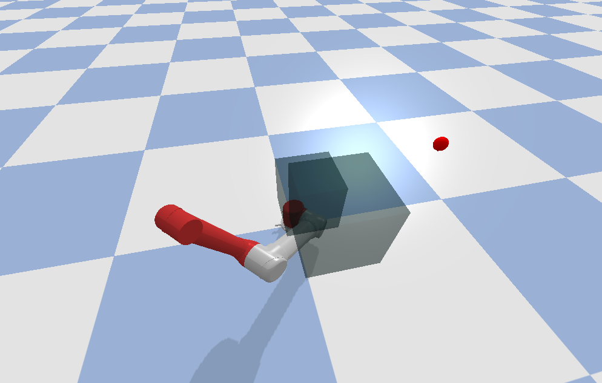

# Lab 3 - Rapidly-exploring Random Tree (RRT)
Lab 3 for [COMSW4733 Computational Aspects of Robotics](https://www.cs.columbia.edu/~allen/F19/) at Columbia University (Instructor: [Prof. Peter Allen](http://www.cs.columbia.edu/~allen/)).

## Introduction
In this lab, you are required to implement the Rapidly-exploring Random Tree (RRT) algorithms for motion planning on a 3DOF robotic arm, using the [pybullet](https://pybullet.org/wordpress/) simulator.

## Usage
This repo is tested with python 2.7 and pybullet 2.5.6. To load the pybullet simulated environment for this lab as shown below, simply run

```
python demo.py
```

In the environment, there is a simplified 3DOF [UR5](https://www.universal-robots.com/products/ur5-robot/?gclid=EAIaIQobChMIu9ny1NOU5QIVhJ6fCh0DKAIMEAAYASAAEgJWuvD_BwE) robotic arm (only the first three non-fixed joints are kept). The goal configuration is visualized using a red sphere marker. There are two semi-transparent black blocks and a plane as obstacles.

<p align="center">
  
</p>


## Example Code Explanation

You should get yourself familiar with the `demo.py` file which contains simple example code using pybullet and an overall structure of the expected submission. Visit [here](https://pythonhosted.org/pybullet/) for the detailed pybullet API.


### Get Arguments
```
def get_args():
    parser = argparse.ArgumentParser()
    parser.add_argument('--birrt', action='store_true', default=False)
    parser.add_argument('--smoothing', action='store_true', default=False)
    args = parser.parse_args()
    return args
```
Use `python demo.py` to run [part 1](#part-1---rrt-50).
Use `python demo.py --birrt` to run [part 2](#part-2---bidirectional-rrt-50).
Use `python demo,py --birrt --smoothing` to run [extra credit](3extra-credit---path-smoothing-10).

### Robot Control
```
def set_joint_positions(body, joints, values):
    assert len(joints) == len(values)
    for joint, value in zip(joints, values):
        p.resetJointState(body, joint, value)
```
The `set_joint_positions` function calls pybullet [`resetJointState`](https://docs.google.com/document/d/10sXEhzFRSnvFcl3XxNGhnD4N2SedqwdAvK3dsihxVUA/edit#heading=h.p3s2oveabizm) to reset the robot arm. It takes the robot body id (`ur5`), the joint indices (`UR5_JOINT_INDICES`) and the corresponding joint values. This is the function that you should use to control the robot arm in this assignment.

### Collision Checking
```
from collision_utils import get_collision_fn
collision_fn = get_collision_fn(ur5, UR5_JOINT_INDICES, obstacles=obstacles,
                                    attachments=[], self_collisions=True,
                                    disabled_collisions=set())
```
We have provided you the function to check if a joint configuration is valid (collision-free and not voilating joint limits). The joint limits for the three joints ([0, 1, 2]) are `[-2pi. 2pi]`, `[-2pi, 2pi]` and `[-pi. pi]`. Simply call `collision_fn(conf)` where `conf` is an array-type of three values.  You can treat this function as a block box and you don't need to worry about its detailed implementation. But you are welcome to take a closer look at [`collision_utils.py`](collision_utils.py) if interested.

### Visualization
```
def draw_sphere_marker(position, radius, color):
   vs_id = p.createVisualShape(p.GEOM_SPHERE, radius=radius, rgbaColor=color)
   marker_id = p.createMultiBody(basePosition=position, baseCollisionShapeIndex=-1, baseVisualShapeIndex=vs_id)
   return marker_id

def remove_marker(marker_id):
   p.removeBody(marker_id)
```
We have also provided you with a simple function `draw_sphere_marker` to create a sphere marker given its [x, y, z] position, radius and [r, g, b, a] color. `remove_marker` will cimply remove the corresponding marker by its id. In order to draw lines to visualize the tree, take a look at the pybullet function [addUserDebugLine](https://docs.google.com/document/d/10sXEhzFRSnvFcl3XxNGhnD4N2SedqwdAvK3dsihxVUA/edit#heading=h.i3ffpefe7f3).

## Details and Rubric
Take a look at [here](https://www.cs.columbia.edu/~allen/F19/NOTES/probabilistic_path_planning.pdf) for the RRT and Bidirectional RRT algorithms.

### Part 1 - RRT (50%)
In this part, you should implement the RRT algorithm to plan a collision-free motion to reach the target configuration (specified in the `demo.py`). See a video demo for this part [here](https://youtu.be/o-RCIhsLmqw). 

- Build the tree and visualization (30%). 
- Find and visualize the solution path (10%).
- Control the robot to move to the target configuration following the found path (10%). In your video you should rotate the camera in pybullet to show that no collision happens.

We will test your code with the command `python demo.py`.

### Part 2 - Bidirectional RRT (50%)
In this part, you should implement the bidirectional RRT algorithm to plan a collision-free motion to reach the target configuration (specified in the `demo.py`). See a video demo for this part [here](https://youtu.be/4nFmFcLg5RQ).

- Build the tree and visualization (30%). You should use different colors for different trees.
- Find and visualize the solution path (10%).
- Control the robot to move to the target configuration following the found path (10%). In your video you should rotate the camera in pybullet to show that no collision happens.

We will test your code with the command `python demo.py --birrt`.

### Extra Credit - Path Smoothing (10%)
In this part, you should implement the following path smoothing algorithm on the found path with BiRRT. See a video demo for this part [here](https://youtu.be/ZaWURj-lgkQ).

```
Repeat N times:
- Pick two points on the path at random
- See if we can linearly interpolate between those points without collisions
- If so, then snip out that segment of the path.
```

The video shows a smooting algorithm with N = 20. In your video, you should show a path shorter than the found path.

## Submission Instructions
TODO